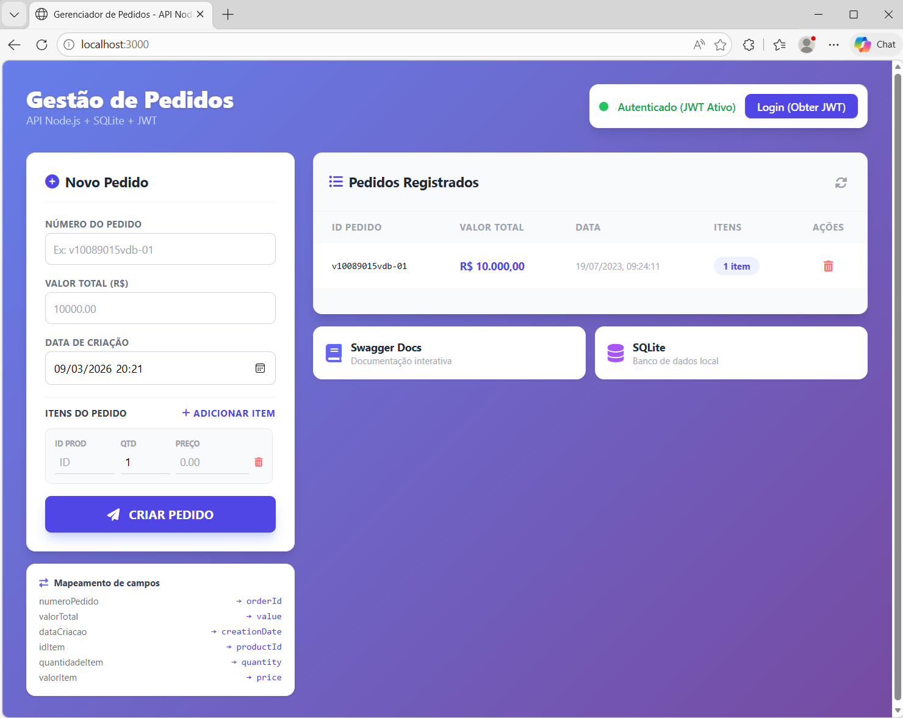

# Order Management API - Node.js & SQLite

API REST para gerenciamento de pedidos desenvolvida em Node.js com Express, SQLite, JWT e Swagger.

---

## Funcionalidades

- **CRUD de Pedidos**: Criar, Ler, Atualizar e Deletar pedidos
- **Data Transformation**: Mapeamento automático dos campos do JSON de entrada para o esquema do banco
- **Autenticação JWT**: Segurança nos endpoints de escrita (POST, PUT, DELETE)
- **Banco de Dados SQL**: Persistência com SQLite via `better-sqlite3`
- **Paginação**: Listagem de pedidos com `page` e `limit`
- **Documentação Swagger**: Interface interativa disponível em `/api-docs`
- **Front-end Integrado**: Painel de gestão de pedidos em `/`
- **Testes Automatizados**: Suíte de testes com Jest e Supertest

---

## Instalação e Execução

### Pré-requisitos
- Node.js v14+
- npm

### Instalar dependências
```bash
npm install
```

### Executar
```bash
npm start
```

| Recurso | URL |
|:---|:---|
| Front-end | http://localhost:3000 |
| Swagger | http://localhost:3000/api-docs |

---

## Estrutura do Projeto

```
order-management-api/
├── public/
│ └── index.html # Front-end estático (painel de gestão de pedidos)
│
├── src/
│ ├── config/
│ │ ├── database.js # Conexão SQLite e inicialização do banco
│ │ └── swagger.js # Configuração da documentação Swagger
│ │
│ ├── controllers/
│ │ └── orderController.js # Controladores HTTP (camada entre rotas e serviços)
│ │
│ ├── services/
│ │ └── orderService.js # Regras de negócio da aplicação
│ │
│ ├── models/
│ │ └── orderModel.js # Acesso ao banco e queries SQL
│ │
│ ├── routes/
│ │ ├── authRoutes.js # Rotas de autenticação (/login, /auth/token)
│ │ └── orderRoutes.js # Rotas CRUD de pedidos (/order)
│ │
│ ├── middlewares/
│ │ ├── auth.js # Middleware de autenticação JWT
│ │ └── validateOrder.js # Validação do payload de pedidos
│ │
│ ├── utils/
│ │ ├── errors.js # Classes de erro customizadas
│ │ ├── logger.js # Logger da aplicação
│ │ └── mapper.js # Transformação JSON ↔ Banco de Dados
│
├── server.js # Entry point da aplicação Express
│
├── schema.sql # Script de criação das tabelas SQLite
│
├── api.test.js # Testes de integração com Jest + Supertest
├── frontend_test.js # Testes end-to-end via HTTP contra servidor rodando
│
├── index_raw.html # Versão original do front-end (referência)
│
├── env.example # Exemplo de variáveis de ambiente
│
├── package.json # Dependências e scripts do projeto
└── package-lock.json # Lock de dependências
```

---

### Arquitetura

O projeto segue uma arquitetura em camadas:

Routes → Controllers → Services → Models → Database

- **Routes**: definem os endpoints da API
- **Controllers**: recebem requisições e retornam respostas HTTP
- **Services**: implementam regras de negócio
- **Models**: executam queries SQL
- **Utils/Middlewares**: suporte (auth, validação, logs, mapping)

Essa separação melhora **manutenção, testabilidade e escalabilidade** da aplicação.

---


## Modelo do Banco de Dados (SQL)

### Tabela: `Order` (Pedidos)

| Coluna | Tipo | Descrição |
|:---|:---|:---|
| `orderId` | TEXT | Chave Primária |
| `value` | REAL | Valor total do pedido |
| `creationDate` | TEXT | Data de criação (ISO 8601) |

### Tabela: `Items` (Itens do Pedido)

| Coluna | Tipo | Descrição |
|:---|:---|:---|
| `orderId` | TEXT | Chave Estrangeira → `Order.orderId` |
| `productId` | INTEGER | ID do produto |
| `quantity` | INTEGER | Quantidade |
| `price` | REAL | Preço unitário |

A exclusão de um pedido remove automaticamente seus itens via `ON DELETE CASCADE`.

---

## Transformação de Dados (Mapping)

| Campo de Entrada (JSON) | Campo no Banco (SQL) | Transformação |
|:---|:---|:---|
| `numeroPedido` | `orderId` | Direto (string) |
| `valorTotal` | `value` | Direto (number) |
| `dataCriacao` | `creationDate` | Conversão para ISO 8601 |
| `items[].idItem` | `items[].productId` | String → Integer |
| `items[].quantidadeItem` | `items[].quantity` | Direto (integer) |
| `items[].valorItem` | `items[].price` | Direto (number) |

---

## Autenticação JWT

Todos os endpoints de escrita (POST, PUT, DELETE) exigem autenticação.

**Obter token (com credenciais):**
```bash
curl -X POST http://localhost:3000/auth/token \
  -H "Content-Type: application/json" \
  -d '{"username": "admin", "password": "admin123"}'
```

**Obter token (acesso rápido - usado pelo front-end):**
```bash
curl -X POST http://localhost:3000/login
```

**Usar o token nas requisições:**
```
Authorization: Bearer <token>
```

---

## Endpoints

| Método | URL | Autenticação | Descrição |
|:---|:---|:---:|:---|
| POST | `/login` | Não | Token JWT rápido (front-end) |
| POST | `/auth/token` | Não | Token JWT com credenciais |
| POST | `/order` | Sim | Cria um novo pedido |
| GET | `/order/list` | Sim | Lista pedidos (paginado) |
| GET | `/order/:orderId` | Sim | Busca pedido por ID |
| PUT | `/order/:orderId` | Sim | Atualiza pedido |
| DELETE | `/order/:orderId` | Sim | Remove pedido |
| GET | `/api-docs` | Não | Documentação Swagger |

### Parâmetros de paginação (`GET /order/list`)

| Parâmetro | Tipo | Padrão | Descrição |
|:---|:---|:---|:---|
| `page` | integer | 1 | Número da página |
| `limit` | integer | 10 | Itens por página (máx. 100) |

---

## Testes

```bash
npm test
```

A suíte cobre:
- Geração de token JWT
- Criação de pedido e validação do mapeamento
- Autenticação obrigatória (401)
- Validação de dados (400)
- Conflito de `orderId` duplicado (409)
- Busca de pedido existente e inexistente (404)
- Listagem paginada
- Atualização de pedido
- Exclusão de pedido

---

## Teste End-to-End (Frontend + API)

Com o servidor em execução:
```bash
npm start
```
Execute o teste:

```bash
node frontend_test.js
```

O script valida:
- Carregamento da página /
- Acesso à documentação /api-docs
- Fluxo completo da aplicação (login, criação, busca, listagem, atualização e exclusão de pedidos) através de requisições HTTP reais.

---

## Exemplo de Request

```bash
curl -X POST http://localhost:3000/order \
  -H "Content-Type: application/json" \
  -H "Authorization: Bearer <token>" \
  -d '{
    "numeroPedido": "v10089015vdb-01",
    "valorTotal": 10000,
    "dataCriacao": "2023-07-19T12:24:11.5299601+00:00",
    "items": [
      { "idItem": "2434", "quantidadeItem": 1, "valorItem": 1000 }
    ]
  }'
```

**Resposta (201):**
```json
{
  "orderId": "v10089015vdb-01",
  "value": 10000,
  "creationDate": "2023-07-19T12:24:11.529Z",
  "items": [
    { "productId": 2434, "quantity": 1, "price": 1000 }
  ]
}
```

---

## Códigos de Resposta HTTP

| Código | Significado |
|:---|:---|
| 200 | Sucesso |
| 201 | Recurso criado |
| 400 | Dados inválidos ou ausentes |
| 401 | Token JWT ausente |
| 404 | Pedido não encontrado |
| 409 | `orderId` já existe (conflito) |
| 500 | Erro interno do servidor |

---

## Interface da Aplicação



---
